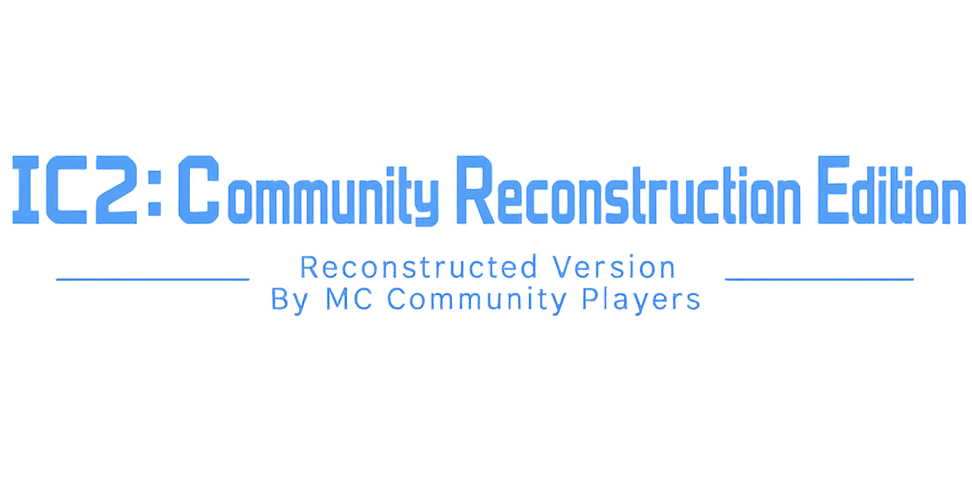

# Industrial Craft 2: Community Reconstruction Edition
# 工业时代2：社区重构版
####
- **Display name:** IC2: Community Reconstruction Edition 
- **模组名:**  IC2: Community Reconstruction Edition
- **Short name:** IC2CRE
- **模组简称:** IC2CRE
- **Mod ID:** ic2cre
- **模组 ID:** ic2cre

#### **This project does not have any discussion groups or communication channels. Information about this project is only available on the project's release page repository. The project itself is free of charge, with no fees of any kind. Please be cautious to avoid being deceived!!!**
#### **项目无任何交流群、交流频道，本项目信息仅在发布页仓库公示，项目本身免费，无任何收费，谨防上当受骗！！！**

### 介绍 Introduction
## Note: IC2: Community Reconstruction Edition is not developed by the IC2 Dev Team and has not been authorized. This Community Reconstruction Edition has been ported and reconstructed to version 1.21.1 by community players from an earlier version of IC2 and is not an official version.
## 注意：IC2: Community Reconstruction Edition并非IC2 Dev Team开发且并未获得授权，此Community Reconstruction Edition为由社区玩家由低版本IC2移植并重构至1.21.1，非官方版本。
- Industrial Craft 2: Community Reconstruction Edition is a reconstruction of the IC2 concepts and machine behavior on the NeoForge loader. The project takes the classic IC2 implementation as a reference, but the codebase is being reorganized toward a more modern and easier-to-maintain architecture.In order to respect IC2 and individual development capabilities, this restructured version still uses the Industrial Craft 2-2.8.222-ex112 asset files. At the same time, the relevant asset files remain under the copyright of the Industrial Craft Dev Team (or are held personally by the creators).
- 工业时代2：社区重构版是在NeoForge加载器上，对IC2概念和机器行为的重新构建。该项目以经典的IC2实现为参考，但代码库正在重组，朝向更现代、更易维护的架构。为尊重IC2以及个人开发能力，本重构版仍使用Industrial Craft 2-2.8.222-ex112资产文件，同时相关资产文件仍由Industrial Craft Dev Team保留（亦或者个人持有绘制版权）相关版权。
- Information Release: The first development version (dev.x.x) is expected to be released at the end of July.
- 发布信息：预计首个开发版（dev.x.x）在七月底发布。
### 游玩提示
- This project mod is based on the prerequisite (Energy Core) energy core as the energy system. It needs this mod as a prerequisite to load normally; otherwise, it will prompt that the prerequisite is missing and cannot load.[[Downloads Energy Core]](https://github.com/BigFish520/Energy-Core "[Energy Core]")
- 本项目模组基于前置（Energy Core）能量核心作能量系统，需要将此模组作为前置才可正常加载，否则会提示无该前置导致无法加载。 [[下载Energy Core]](https://github.com/BigFish520/Energy-Core "[Energy Core]")
### 版本管理 Version Control
- Version Classification: Official Release Version (Release Version - RV.xx), Preview Version (Preview Version - PV.xx), Development Version (Development Version - Dev.xx)
- 版本区分：正式发布版（Release Version-RV.xx） 预览版本（Preview Version-PV.xx） 开发版（Development Version-Dev.xx）
- What do all of these mean?
- 这些都是什么意思？
- Release Version-RV.rv_21.x.x：The official version serves as a long-term, relatively stable version, with fewer errors.
- 正式发布版：正式版则作为长期较稳定版本，错误较少。
- Preview Version-PV.pv_21.x.x：The preview version is released based on the development version as a short-term stability test version. At this stage, the direction and content of updates have been generally confirmed to be correct and without major changes.
- 预览版本：预览版则在开发版基础上，发布一个短期测试稳定性版本，此时更新方向及内容已大致确认 无误且无重大更改。
- Development Version-Dev.dev.x.x：The development version allows for the priority experience of new content; however, this new content is added on a development basis and may be removed or revised at any time. Additionally, it contains numerous errors and omissions, serving as an early-stage development version.
- 开发版：开发版则优先体验新内容，但该新内容则是开发性新增，随时可能会被移除或重新修正，同时存在大量错误以及缺失，作为开发早期版本。
### 建议与反馈 Suggestions and Feedback
- If you have any suggestions or encounter any bugs during gameplay, please submit them here as issues (please include the relevant crash reports).
- 如果你有任何建议，或游玩过程中出现的bug，请在此提交[Lssues](https://github.com/BigFish520/IC2-CRE/issues "Lssues")（请包含相关crash-reports报告）。
### 更多信息 
- According to the development schedule, the project will be open-sourced after the version becomes stable. This project has not obtained authorization from the IC2 Dev Team or the original holder, and is solely developed by the community based on IC2 1.12.2 and reconstructed up to 1.21.1. The project has optimized a large amount of architecture and development specifications, as well as some basic logic, aiming to restore and enhance the IC2 experience.
- 根据开发进度，项目开源将在版本稳定后，给予开源，本项目未获得IC2 Dev Team或原持有人等授权，仅由社区基于1.12.2IC2重构开发至1.21.1，本项目优化了大量架构及开发规范、部分基础逻辑，致力还原及优化IC2体验。

- This module is supplemented by the [MIT](https://github.com/BigFish520/IC2-CRE?tab=MIT-1-ov-file "MIT") License. If you believe that any of its asset files, code, etc., involve disputes or other issues, please contact the owner. If the dispute is verified, the content will be removed and taken down.
- 此模组由[MIT](https://github.com/BigFish520/IC2-CRE?tab=MIT-1-ov-file "MIT")协议补充，若您认为其中的资产文件、代码等涉及争议等问题，请联系所有者，若争议属实，将进行删除下架。